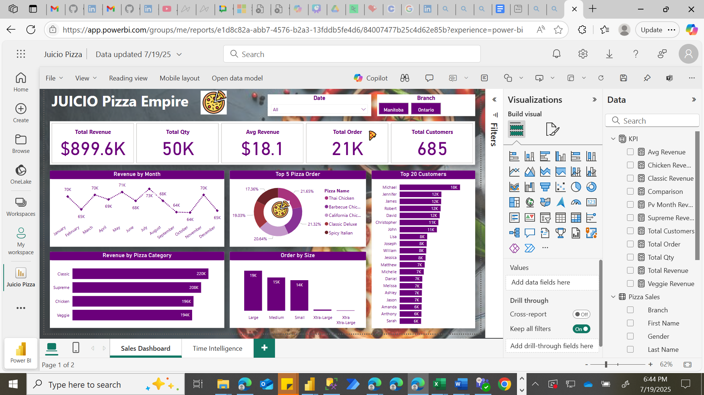
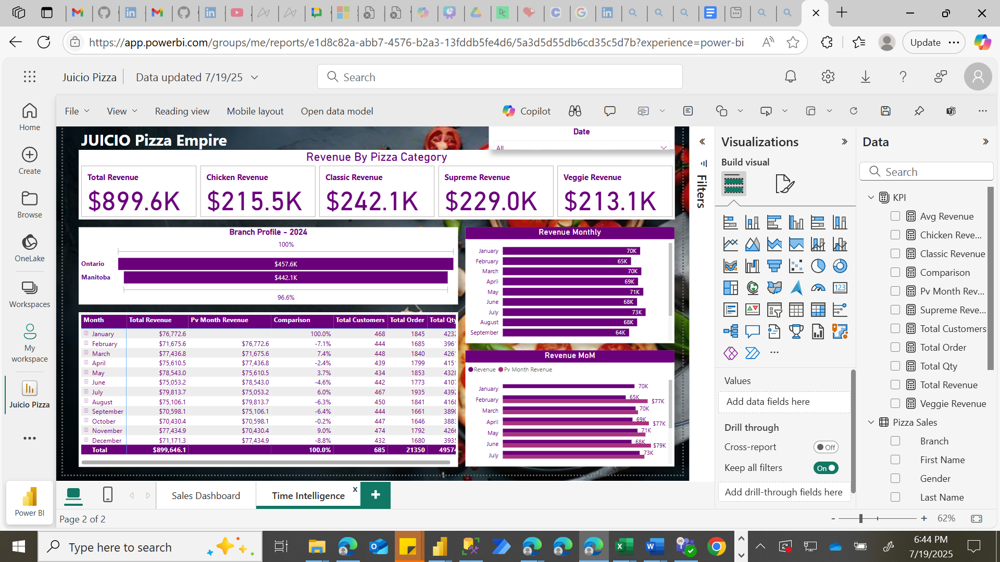

# JUICIO Pizza Empire – Sales Dashboard
## Overview

This interactive Power BI dashboard provides a comprehensive analysis of sales, customer behavior, and product performance for JUICIO Pizza Empire. It is designed to help stakeholders monitor key metrics, identify top-performing products, and make data-driven decisions. Measures used can be found in the file.

## 📁 Files Included
- JUICIO_Pizza_Empire.pbix: Power BI dashboard file
- README.md: Project documentation
- Dashboard_preview.png: Screenshot of the main dashboard

[Link to published dashboard](https://app.powerbi.com/reportEmbed?reportId=e1d8c82a-abb7-4576-b2a3-13fddb5fe4d6&autoAuth=true&ctid=8181d9cb-5210-43e7-9ee2-65cd69ce2a3a) but you will need access to view it.

## Key Metrics
- Total Revenue: \$899.6K 
- Total Quantity Sold: 50K 
- Average Revenue per Item: \$18.1 
- Total Orders: 21K 
- Total Customers: 685 

## 📈 Visual Insights
### Revenue by Month
A line chart shows monthly revenue trends, with consistent performance across the year:
- Highest: April (\$71K)
- Lowest: October (\$63K)
### 🍕 Top 5 Pizza Orders
1.	Thai Chicken – 21.65% 
2.	Barbecue Chicken – 21.32% 
3.	California Chicken – 20.64% 
4.	Classic Deluxe – 19.03% 
5.	Spicy Italian – 17.36%
### 🧾 Revenue by Pizza Category
- Classic: \$220K 
- Supreme: \$208K 
- Chicken: \$196K 
- Veggie: \$194K 
### 📦 Orders by Size
- Large: 19K 
- Medium: 15K 
- Small: 14K 
### 👥 Top 20 Customers by Revenue
1. Michael: \$18K 
2. Jennifer, James, Robert: \$12K each 
3. David, Christopher, John: \$11K each 
4. Others: \$6K–\$8K 
## 🛠️ Tools Used
- Excel for cleaning
- Power BI Desktop
- DAX for calculated measures
- Custom Measures Table for clean model organization
## How to Use
1.	Download the .pbix file.
2.	Open it in Power BI Desktop.
3.	Explore the dashboard using filters and visuals.
4.	Review the Measures Table for key KPIs and calculations.
## Contact
For custom dashboards or collaboration: UCHEBUWA NORA GEORGE
- 📧 uchebuwaisewede@gmail.com
- 🌐 [LinkedIn](www.linkedin.com/in/uchebuwa-george-isewede-mba-87488aa8)
